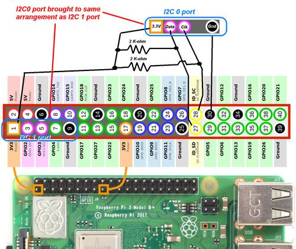

# CO2-Ampel am Raspberry-Pi

* Raspberry Pi
* USB-Ampel von Cleware
* CO2-Sensor SCD 30 
* Display tbd

## Software

* SCD30-I2C Python - SW : https://pypi.org/project/scd30-i2c
* USB-Ampel : https://github.com/jenszech/StatusLight
* bzw : 

## Other SCD30-Software

* Nutze inzwischen (co2-ampel-II.py) den Treiber-code von sensirion selbst

## Zweiter I2C-Bus

Moechte nun 2 (besser noch 3) SCD 30 Sensoren mal eine Woche an der frischen Luft laufen lassen um zu sehen, inwieweit sich die Messwerte angleichen.

Der Raspberry Pi hat zwei I2C-Busse eingebaut, der andere (I2C-Bus 0) muss jedoch erst per Config eingeschaltet werden.

Mehr Infos dazu : https://www.woodgears.ca/tech/i2c.html
Anschluss : 

### Dritter I2C-Bus 

Fuer den 3ten Sensor habe ich mir einen exteren USB2I2C-Adapter besorgt.  
Mehr Infos dazu gibt es u.a im Raspberry Pi Geek Magazin:

* https://www.raspberry-pi-geek.de/ausgaben/rpg/2020/06/i-2-c-teil-31-usb-i-2-c-modul-mcp23017/
* http://www.chinalctech.com/cpzx/Programmer/Serial_Module/266.html
* 
und hier

