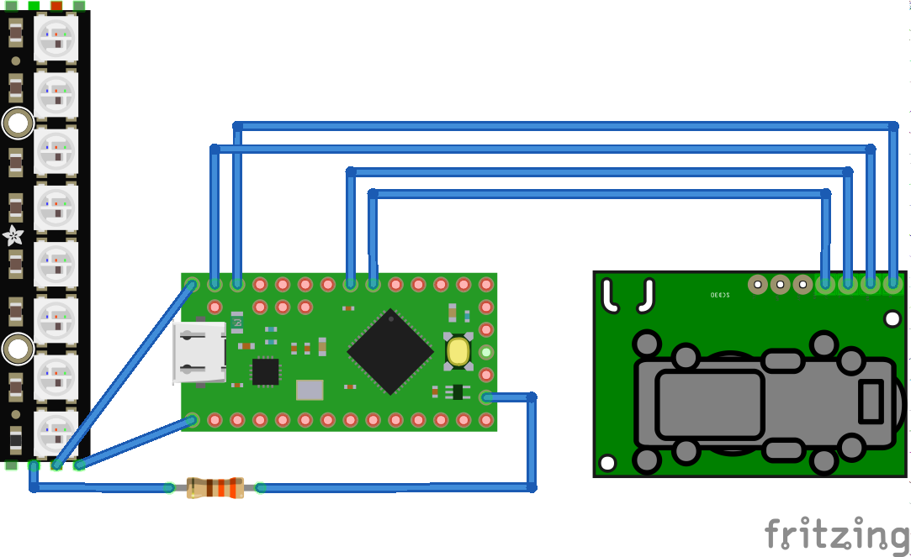
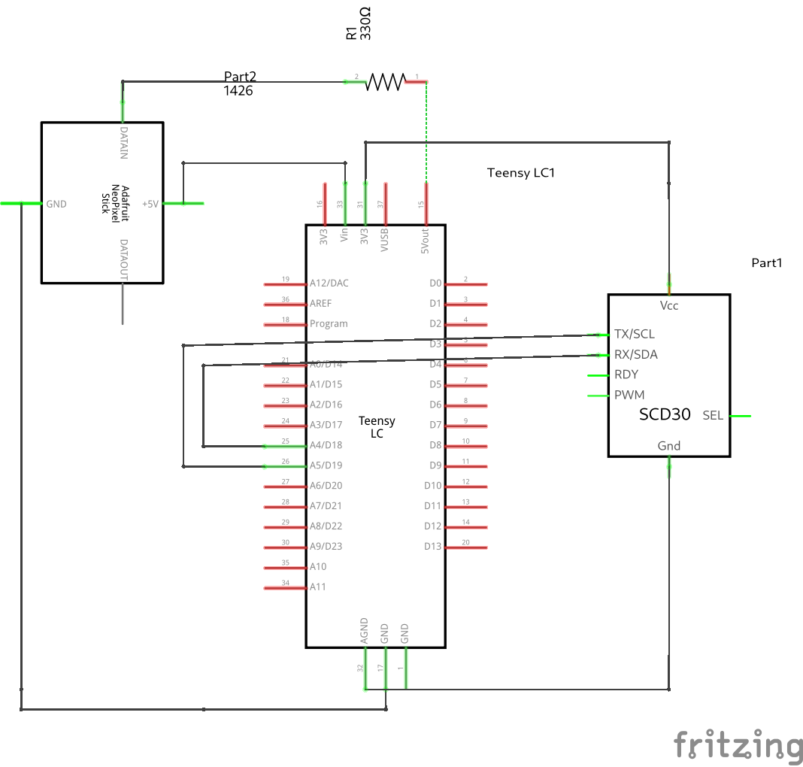
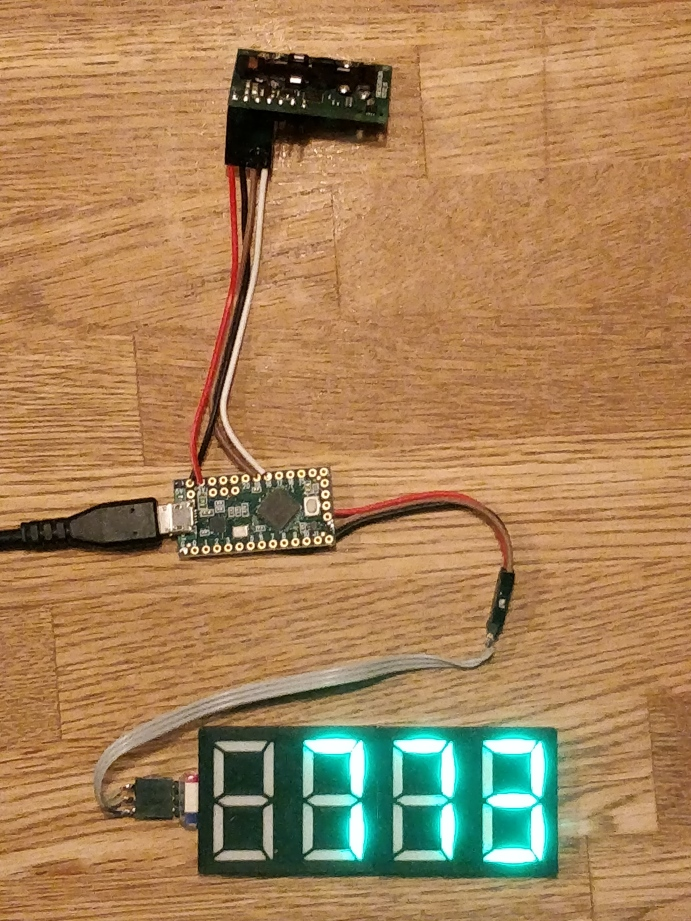
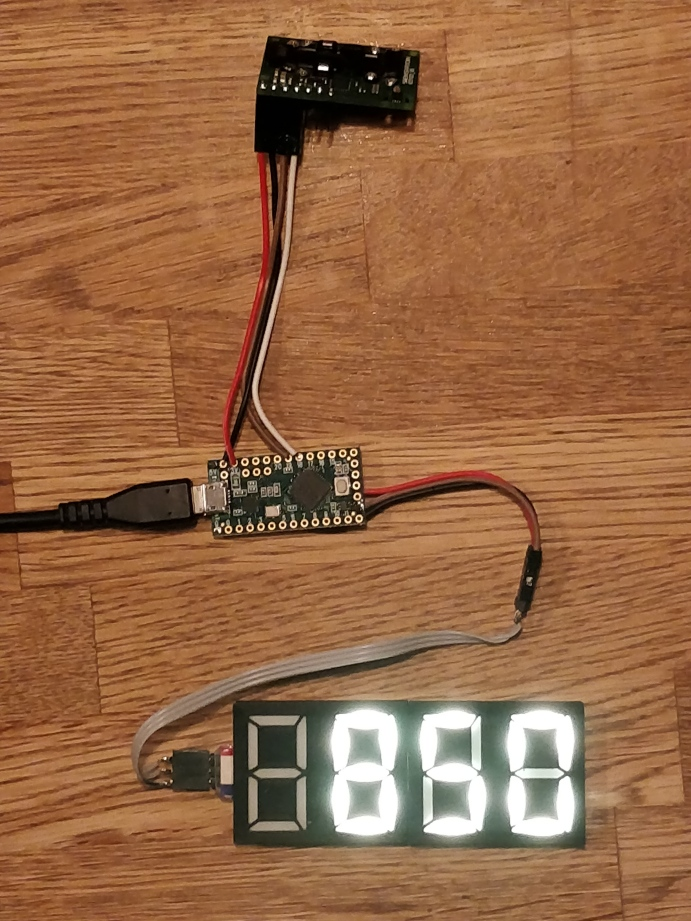

# Teensy LC USB-Ampel mit Neosegments

* Der Sensirion SCD30 CO2-Sensor wird mit I2C angesprochen
* dafür gibt es eine Library, SparkFun_SCD30_Arduino_Library 
* diese wurde gepatcht, um mit anstatt mit der wire-I2C-library die besser für Teensy 3 / Teensy LC geeignete i2c_t3 - Library zu verwenden
* Der gepatchte part der Library ist hier auch abgelegt 
* Die Anzeige wurde über die (leider nicht mehr verfügbaren) Neo-Segments von crowdsupply realisiert : [https://www.crowdsupply.com/maksmakes/neosegment](https://www.crowdsupply.com/maksmakes/neosegment)

## Layout von Fritzing

### Breadboard

### Schematics

## Fliegender Aufbau

### Noch im grünen Bereich
 

### Grösser 800 ppm : Gelb

## Implementierungs-Details

* Es Wird alle 2 sek gemessen
* Vier Werte werden aufsummiert und daraus der Mittelwert gebildet
* Alle 8 Sekunden liegt ein neuer Mittelwert vor, der dann 8 sek lang angezeigt wird
* bis 799 ppm : Grün
* bis 999 ppm : Gelb
* bis 1199 ppm : Rot
* Grössr/gleich 1200 ppm : Rot blinkend
* Beim Einschalten liegt noch kein Wert vor: es wird 8888 in blau angezeigt

 
 
 
