# CO2-Ampel mit Neopixel-Ring und OLED-Display

* Sensor Sensirion SCD30 für CO2-Messung
* Neopixel-Ring mit 16 RGB-Leds, je LED für 100 ppm
* Die LEDs wechseln natürlich auch die Farbe
* zusätzlich ein Mini-OLED-Display, das die ppm-Werte anzeigt (bei Teensy LC / 3.0 bitte meinen Branch von u8g2 benutzen, der kann Teensy 3.x / LC )
* Zur Helligkeits-Regulierung des Neo-Pixel-Rings wird ein BCD-10-Stellen-Drehschalter eingesetzt.
  (In Fritzing gibt es den nur als Hexa-Dezimal von 0-F ...)
* Ich hatte Probleme mit OLED und SCD30 am selben I2C-Bus, alle Tips im Netz zum Thema I2C <=> Teensy LC haben nichts bewirkt, mein OSZI steht leider Corona-bedingt in Deutschland, darumkonnte ich nicht messen ... => Darum habe ich die beiden Devices an die beiden unterschiedlichen I2C-Busse des Teensy LC gehängt

## Layout von Fritzing 

### Fritzing-File

[CO2_Ampel_Teensy_Neopixel_OLED.fzz](pics/CO2_Ampel_Teensy_Neopixel_OLED.fzz)

### Breadboard

Auch hier , wie im "Nachbar-Projekt", den Neopixel 16er-Ring gibt es nicht, darum eben als 10er Stick.
Da die elektrische Verbindung genau gleich wie bei klassischen Neopixel-Sticks ist,   
wurden diese ersatzweise für den Stromlauf/Layout verwendet.

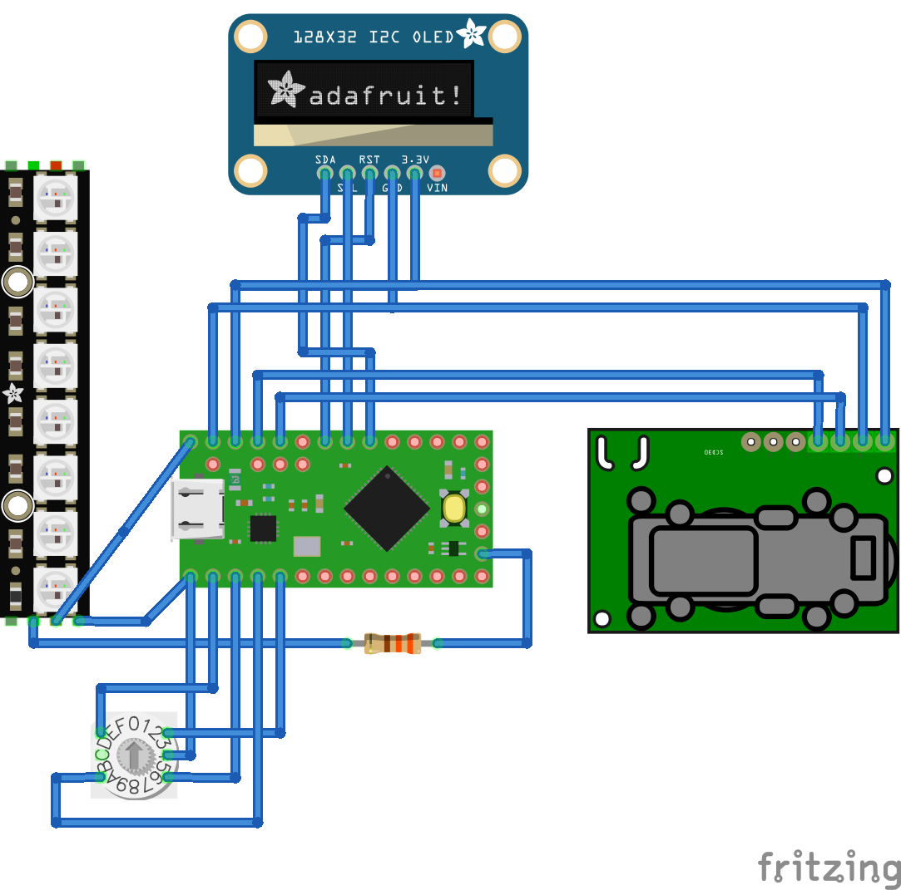

### Schematics

  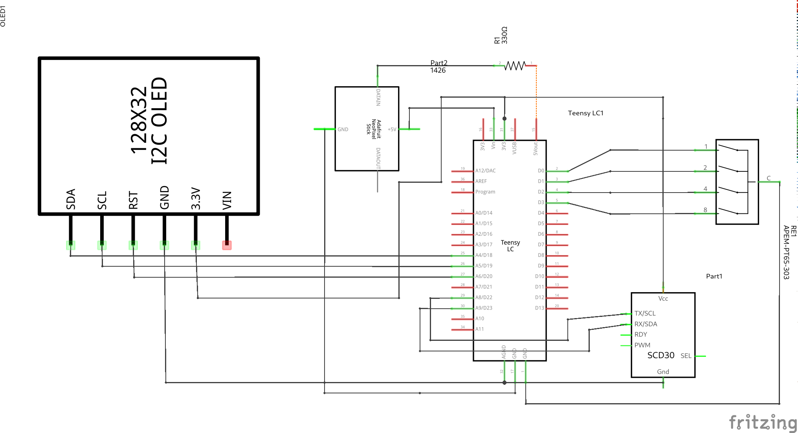

## Fotos vom Aufbau

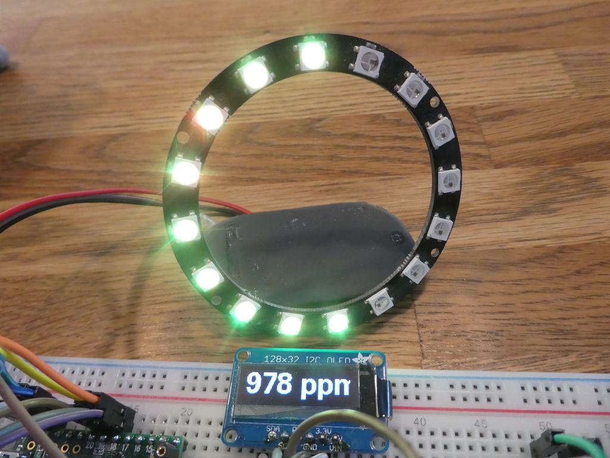

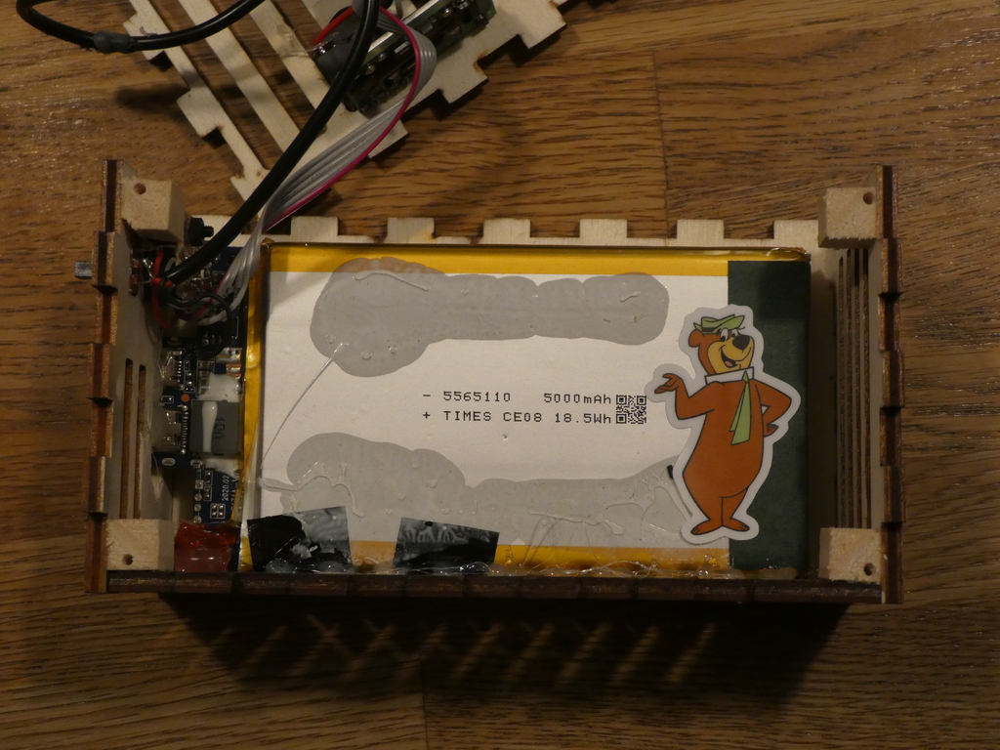

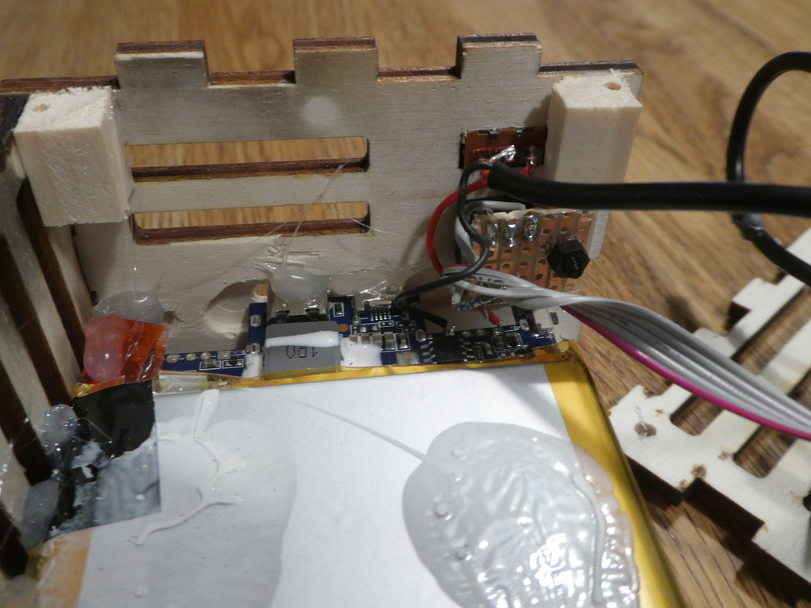

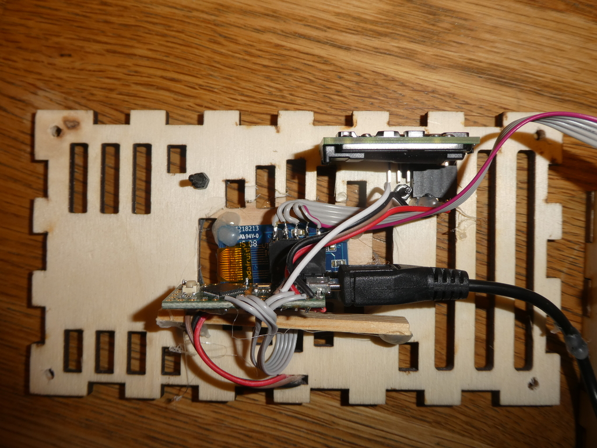

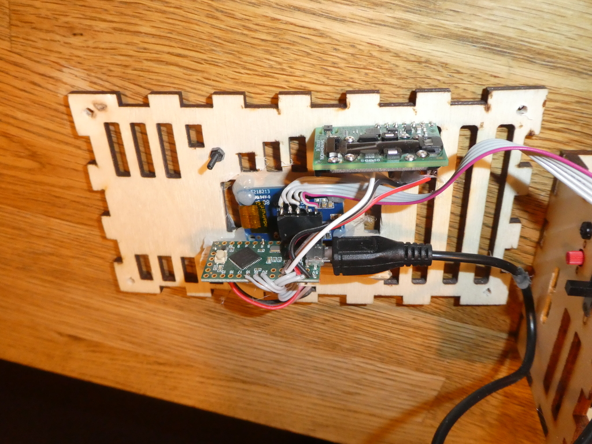

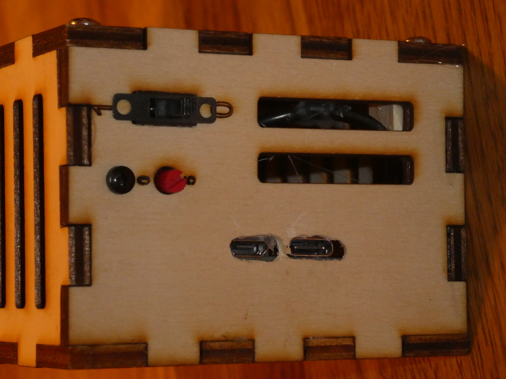

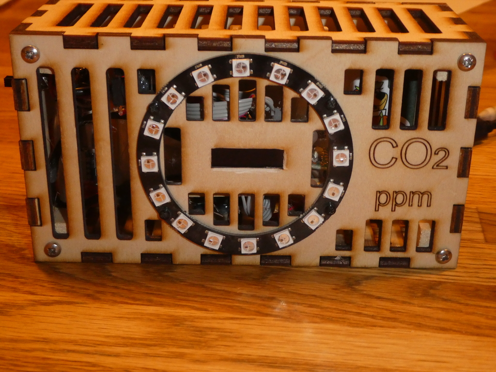

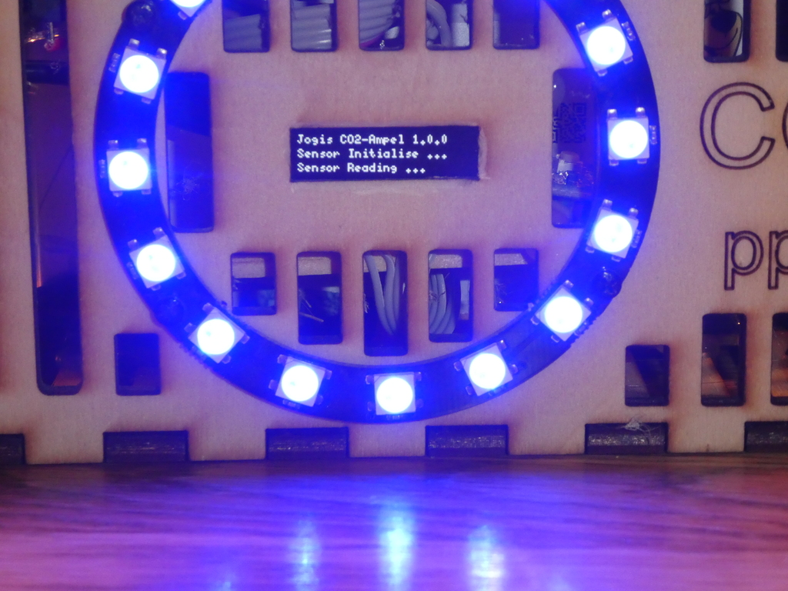

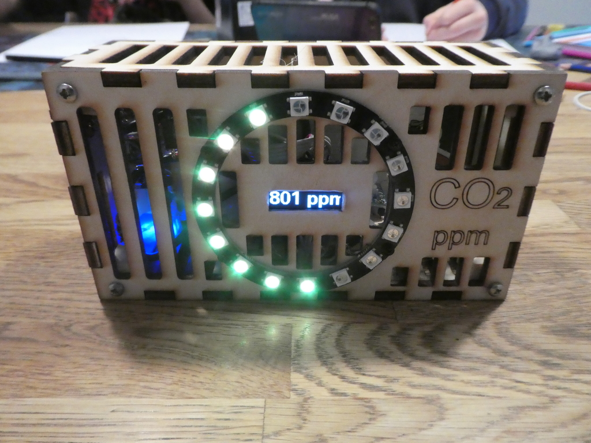

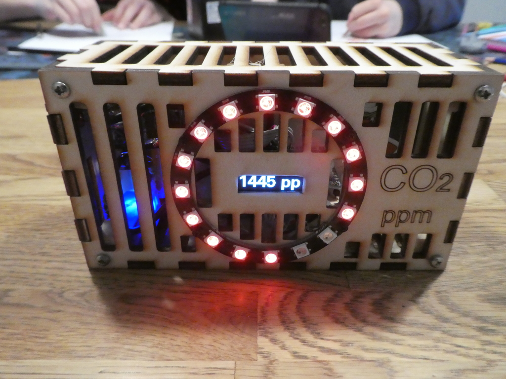
